## Project: Control of a 3D Quadrotor
<p align="center"></p>

---

# Required Steps:
1. Implemented body rate control in python and C++.
2. Implement roll pitch control in python and C++.
3. Implement altitude control in python.
4. Implement altitude controller in C++.
5. Implement lateral position control in python and C++.
6. Implement yaw control in python and C++.
7. Implement calculating the motor commands given commanded thrust and moments in C++.
8. Congratulations!  Your Done!

## [Rubric](https://review.udacity.com/#!/rubrics/1643/view) Points
### Here I will consider the rubric points individually and describe how I addressed each point in my implementation.  

:snake: Python proposed controller gains
  
| z_kp | z_kd | x_kp | x_kd | y_kp | y_kd | kp_roll | kp_pitch | kp_yaw | kp_p | kp_k | kp_r | 
| --- | --- | --- | --- |--- | --- | --- | --- |--- | --- | --- | --- |
|4.0 | 2.5 | 5.0 | 4.0 | 5.0 | 4.0| 6.0 | 6.0 | 4.0 | 25.0 | 25.0 | 6.0|

  
:heavy_plus_sign::heavy_plus_sign: C++ proposed controller gains
  
| z_kp| z_kd | z_ki | xy_kp | xy_kd | kp_bank | kp_yaw | kp_p | kp_k | kp_r | 
| --- | --- | --- | --- |--- | --- | --- | --- |--- | --- | 
|15.0  |8.0 | 15.0 | 14.0 | 4.0 | 12.0| 5.0 | 65.0 | 60.0 | 10.0 |

---

### 1. Implemented body rate control in python and C++.
The controller should be a proportional controller on body rates to commanded moments. The controller should take into account the moments of inertia of the drone when calculating the commanded moments.

The commanded roll, pitch, and yaw rotational accelerations in the body frame are obtained using a Proportional controller with form:

<p align="center"></p>

We convert this rotational accelerations into Torques using the moment of inertia for roll, pitch, and yaw:

<p align="center">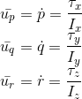</p>

#### :snake: Python body rate control

Refer to lines 213-22 in controller.py

Notice that the x, y, z Torque is constrained into a MAX_TORQUE value to account for a more realistic implementation.

#### :heavy_plus_sign::heavy_plus_sign: C++ body rate control

Refer to lines 104-106 in QuadControl.cpp

### 2. Implement roll pitch control in python and C++.
The controller should use the acceleration and thrust commands, in addition to the vehicle attitude to output a body rate command. 
The controller should account for the non-linear transformation from local accelerations to body rates. Note that the drone's mass should be accounted for when calculating the target angles.

The roll pitch controller uses the commanded lateral accelerations to change the drone's orientation, by commanding
roll and pitch rates pc and qc. A P controller is used to set the desired rate of change.

The commanded rotation have the form:

<p align="center">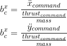</p>

The actual rotation values are the elements R13 and R23 from the rotation matrix:

<p align="center">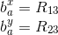</p>

The Proportional controller has the form:

<p align="center">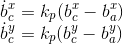</p>

Finally the values are converted into body frame angular velocities:

<p align="center">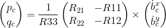</p>

#### :snake: Python roll pitch control
Refer to lines 177-199 in controller.py

#### :heavy_plus_sign::heavy_plus_sign: C++ roll pitch control
Refer to lines 137-150 in QuadControl.cpp

### 3. Implement altitude control in python.
The controller should use both the down position and the down velocity to command thrust. Ensure that the output value is indeed thrust (the drone's mass needs to be accounted for) and that the thrust includes the non-linear effects from non-zero roll/pitch angles.

The altitude controller is implemented as a PD cotroller with a feed forward acceleration command.
The equation representing the altitude PD controller has the form:

<p align="center">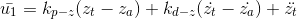</p>

Finally we transform the linear acceleration u1_hat into thrust using the following equation:

<p align="center">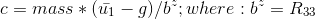</p>

Notice how the linear effects of the roll and pitch angles phi and theta are accounted for in the rotational matrix element R33.

From the altitude controller code in controller.py we can see that the effect of the gravity is already included as a feedforward acceleration command. 

Finally the magnitude of the Thrust is limited to a value MAX_THRUST in the code to account for a more realistic implementation of the controller.

#### :snake: Python altitude control

Refer to lines 144-159 in controller.py.

### 4. Implement altitude controller in C++.
The controller should use both the down position and the down velocity to command thrust. Ensure that the output value is indeed thrust (the drone's mass needs to be accounted for) and that the thrust includes the non-linear effects from non-zero roll/pitch angles.

Additionally, the C++ altitude controller should contain an integrator to handle the weight non-idealities presented in scenario 4.

Similar to the python altitude controller implemented in the previous step, for the c++ implementation we will be adding an Integrator term to the controller. 
This Inegrator will help to compensate the z position error originated from non accounted mass effects, e.g. a drone with a larger mass than the ideal scenarion considered by the PD controller. 
 
The controller equation has the following form:

<p align="center">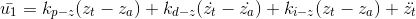</p>

Finally we transform the linear acceleration u1_hat into thrust:

<p align="center"></p>

From the c++ implementation we can see that the velocity is constrained into a range [-maxDescentRate, maxAscentRate] to account for a more realistic scenario.

#### :heavy_plus_sign::heavy_plus_sign: C++ altitude controller
Refer to lines 181-183 in QuadControl.cpp


### 5. Implement lateral position control in python and C++.
The controller should use the local NE position and velocity to generate a commanded local acceleration.

Implementation of the lateral possition control is done using a PD controller with feed forward acceleration; 
notice that in the python controller the acceleration_ff term is by default a [0.0, 0,0] value, nevertheless 
the feedforward term can be useful to improve the precision of the controller if we have access to the information
of the next [x,y] commanded acceleration in advance.  

<p align="center">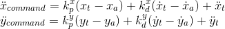</p>

You can try to limit the vertical velocity and acceleration to account for a more realistic scenario.

#### :snake: Python lateral position control

Refer to lines 112-128 in controller.py

#### :heavy_plus_sign::heavy_plus_sign: C++ lateral position control

Refer to lines 216-232 in QuadControl.cpp

### 6. Implement yaw control in python and C++.
The controller can be a linear/proportional heading controller to yaw rate commands (non-linear transformation not required).

This is implemented as a P controller as follows:

<p align="center"></p>

The psi_error is compensated for the yaw rate command to take the shorter spin depending on the yaw_error value:

<p align="center">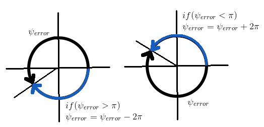</p>

#### :snake: Python yaw control

Refer to lines 238-248 in controller.py

#### :heavy_plus_sign::heavy_plus_sign: C++ yaw control

Refer to lines 253-261 in QuadControl.cpp

### 7. Implement calculating the motor commands given commanded thrust and moments in C++.
The thrust and moments should be converted to the appropriate 4 different desired thrust forces for the moments. 
Ensure that the dimensions of the drone are properly accounted for when calculating thrust from moments.

#### :heavy_plus_sign::heavy_plus_sign: C++ motor commands

<p align="center">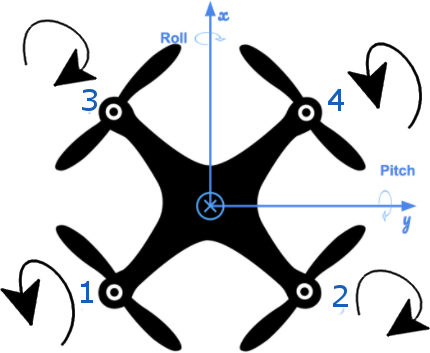</p>

From the image we see the rotation direction of each propeller, the equations for the Collective Force and Moments generated by the propellers are as follows:

<p align="center"></p>

Solving for F1, F2, F3, and F4:

<p align="center">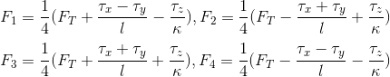</p>

In the C++ *QuadControl::GenerateMotorCommands* method are implemented as:

```
cmd.desiredThrustsN[0] = 0.25f * (collThrustCmd + sqrt(2)/L * (momentCmd.x + momentCmd.y) - momentCmd.z/kappa); // front left
cmd.desiredThrustsN[1] = 0.25f * (collThrustCmd - sqrt(2)/L * (momentCmd.x - momentCmd.y) + momentCmd.z/kappa); // front right
cmd.desiredThrustsN[2] = 0.25f * (collThrustCmd + sqrt(2)/L * (momentCmd.x - momentCmd.y) + momentCmd.z/kappa); // rear left
cmd.desiredThrustsN[3] = 0.25f * (collThrustCmd - sqrt(2)/L * (momentCmd.x + momentCmd.y) - momentCmd.z/kappa); // rear right

```


### Execute the flight
#### 1. Does it work?
It works!

<p align="center"></p>
